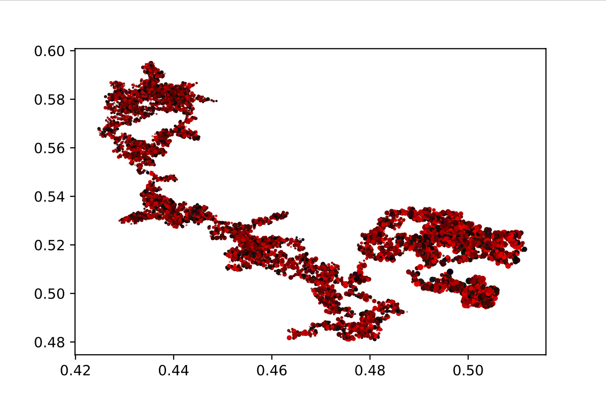
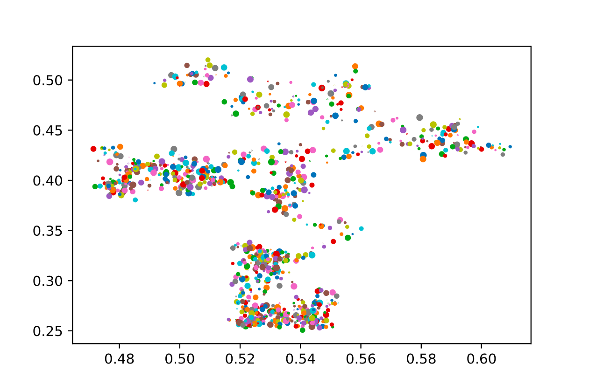
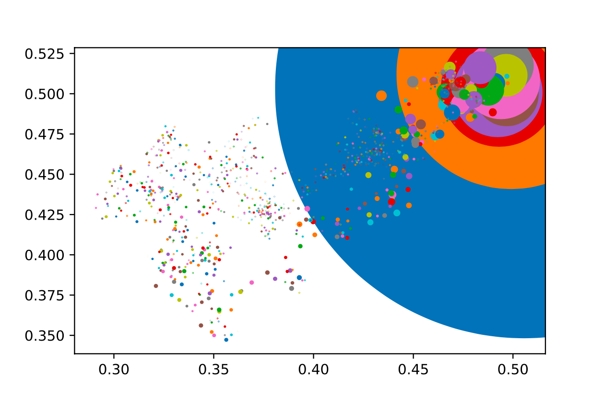

# DRAWINGS

This small program creates random drawings, playing with several parameters.

Files are saved in .pdf because it gives more details.

draw.py can be run directly from cmd.

# PROJECT OWNER

Lilian Marey

# Examples

You can find many examples drawings in /images/old folder.

## My favorites : 

***Red Dragon***

***Multicolor Smoke***

***Blue Sun***

